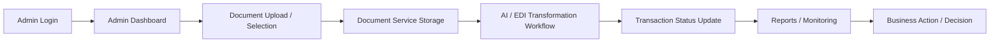

# Retail LLM Client Demo — Flow & Technical Documentation

## 1. Overview

This application is an admin-centric retail document automation platform designed to demonstrate how AI-assisted workflows can simplify document handling, transaction processing, and business operations for retail ecosystems.

The solution combines:
- a web-based frontend for administrative operations and monitoring
- a set of backend microservices for authentication, document processing, AI transformation, and tenant management
- event-driven processing for document transformation and reporting

This document is intended for client demos and should be used as a conversation starter for business value, technical architecture, and user experience.

---

## 2. Business Purpose

The platform helps organizations:
- manage tenants, users, and documents centrally
- upload and process documents through AI/EDI transformation workflows
- monitor transaction status and operational health
- provide a centralized control panel for retail operations
- improve visibility, speed, and consistency of document-driven workflows

---

## 3. Primary Demo Persona

### Admin
The admin persona is the primary demo role for showing platform control and operational intelligence.

Typical flow:
1. Login to the application
2. Land on the Admin Dashboard
3. Review business metrics such as tenants, users, documents, jobs, and storage usage
4. Navigate to document management and EDI transformation screens
5. Upload or review documents and transformation jobs
6. Inspect transaction history and operational reports

---

## 4. End-to-End Application Flow



### Flow Summary
- An admin authenticates through the application.
- The admin accesses the dashboard to view operational metrics.
- A document is uploaded and associated with a tenant and transaction type.
- The document service stores the document metadata and content.
- The transformation workflow processes the document and updates its status.
- The system records transaction history and exposes reporting and monitoring capabilities.

---

## 5. Demo Scenario for Clients

### Recommended 10-Minute Demo Flow

1. Start with Login
   - Show how authentication is handled securely.
   - Highlight role-based access to different dashboards.

2. Show Admin Dashboard
   - Present key metrics and operational overview.
   - Emphasize that the admin gets a single command center for the platform.

3. Show Document Management
   - Upload or view a document.
   - Demonstrate how documents are linked to tenants and transaction types.

4. Show EDI Transformation
   - Trigger the transformation workflow.
   - Show the status progression and completion state.

5. Show Transactions and Reports
   - Open the transaction history view.
   - Show how the platform tracks workflow progress and output.

6. Conclude with Operational Visibility
   - Show how admins can monitor progress, status, and business outcomes from one place.

---

## 6. Technical Architecture

### Frontend
The frontend is a React-based single-page application built with Vite.

Key technologies:
- React 19
- TypeScript
- Vite
- React Router
- React Bootstrap
- Axios for API communication
- i18n support for localization

Main frontend areas:
- Login and authentication experience
- Admin dashboard and management screens
- Shopkeeper dashboard and store modules
- Customer dashboard and shopping modules

### Backend Services
The application is structured as a set of microservices built with modern Java and Spring technologies.

| Service | Purpose | Core Technologies |
|---|---|---|
| Cloud Gateway Service | Entry point for API routing, request handling, and security enforcement | Spring Boot, Spring Cloud Gateway, Spring Security, JWT, Actuator |
| Auth Service | Authentication, authorization, and token-based user access | Spring Boot, Spring Security, JWT, OpenFeign, REST APIs |
| Document Service | Stores document metadata, manages uploads, and tracks processing state | Spring Boot, Spring Data JPA, MySQL, Kafka, MinIO integration |
| AI Transformation Service | Handles transformation logic and AI-assisted document processing | Spring Boot, Kafka, Jackson, MinIO, Qdrant client, protobuf-based processing |
| Tenant Service | Manages tenant-related operations and tenant-level configuration | Spring Boot, REST services, relational persistence |
| Transaction Service | Supports transaction-related workflows and transaction history | Spring Boot, REST APIs, service integration |
| Vector Service | Supports vector/search-oriented capabilities for document and content intelligence | Spring Boot, vector-based services, backend search integration |

### Data and Messaging Layer
- MySQL is used as the primary relational data store for documents, tenants, users, and transaction metadata.
- Kafka is used for event-driven communication between services to support asynchronous processing and workflow updates.
- MinIO is used as object storage for documents and transformation-related content.
- Spring-based services provide the application layer for orchestration, persistence, and API exposure.

### Kafka Topics and Sample Data
Kafka is used to decouple services so that document events and transformation events can be processed asynchronously.

| Topic | Purpose | Sample Message |
|---|---|---|
| document-events | Carries document lifecycle events such as upload, indexing, and transformation progress | {"documentId":"doc-1001","tenant":"RetailHub","status":"processed","type":"XML"} |
| transformation-events | Carries transformation job progress and completion signals | {"jobId":"job-2001","status":"completed","output":"transformed.xml"} |
| notification-events | Carries alerts or workflow status updates for downstream consumers | {"user":"admin","message":"Document processing completed"} |

Why Kafka is used:
- it keeps services loosely coupled
- it supports high-volume async workflows
- it improves reliability during bursts of document processing
- it allows the platform to scale without blocking the user interface

### Qdrant Collection
Qdrant is used to store vector embeddings for semantic search and retrieval over documents and content.

Suggested collection structure:
- collection name: documents_vectors
- vector size: 1536
- distance metric: cosine

Sample document vector record:
```json
{
  "id": "doc-1001",
  "tenant": "RetailHub",
  "content": "EDI invoice document for supplier shipment",
  "embedding": [0.12, 0.45, 0.78, 1.22]
}
```

Why Qdrant is used:
- it enables semantic similarity search
- it helps find related documents and content quickly
- it supports future AI-driven retrieval and insights

### MinIO Folder Structure
MinIO stores the raw and processed documents in a bucket-based structure to keep files organized and easy to retrieve.

Suggested structure:
```text
documents/
  tenants/
    retailhub/
      raw/
        invoice.xml
        purchase-order.txt
      processed/
        invoice-transformed.xml
      archives/
        invoice-v1.xml
```

Why MinIO is used:
- it provides scalable object storage for documents
- it separates raw, processed, and archived files clearly
- it works well with backend services for upload, retrieval, and transformation workflows

### Security Model
- JWT-based authentication
- Role-based route access for admin users
- API requests are routed through the gateway and secured at the service boundary

### Deployment Model
- Docker-ready service structure for containerized deployment
- Kubernetes manifests are available under the deployment folders for container orchestration
- The architecture is designed to support scaling of individual services independently as the platform grows

---

## 7. Key Modules in the Application

### Admin Modules
- Dashboard
- Tenant management
- User management
- Document management
- EDI transformation
- Transaction history
- AI settings
- Prompt templates
- Reports and logs


---

## 8. API and Integration Notes

The frontend communicates with backend services through API endpoints configured in the frontend configuration layer.

Key integration points:
- authentication and login
- tenant and user data retrieval
- document upload and document listing
- transformation job status polling
- transaction history retrieval

This architecture allows the client to see a modern UI connected to backend automation services rather than a monolithic screen-based application.

---

## 9. Suggested Talking Points for the Demo

Use these points during the presentation:
- “This is not only a UI; it is a connected workflow platform.”
- “The platform gives admins a single view of operations and document status.”
- “Documents move through an automated transformation pipeline.”
- “Operational visibility is built in through dashboards, transactions, and logs.”
- “The architecture is modular, making it easier to scale and extend.”

---

## 10. Technical Notes for the Team

### Local Development Notes
- Frontend runs with Vite.
- Backend services run as Spring Boot applications.
- The frontend is configured to call a local gateway URL, which can be adjusted for demo environments.

### Recommended Demo Environment
- Keep the gateway and core services running before the presentation.
- Prepare sample tenant, user, and document data beforehand.
- Use the admin screen to showcase live metrics and workflow status.

---

## 11. Summary

This application demonstrates a practical retail automation platform that combines:
- administrative control and visibility
- document workflow automation
- AI-driven transformation capabilities
- operational visibility and reporting

For a client demo, the strongest story is that the platform is both business-friendly and technically robust, showing real workflow automation from admin action to backend processing.
